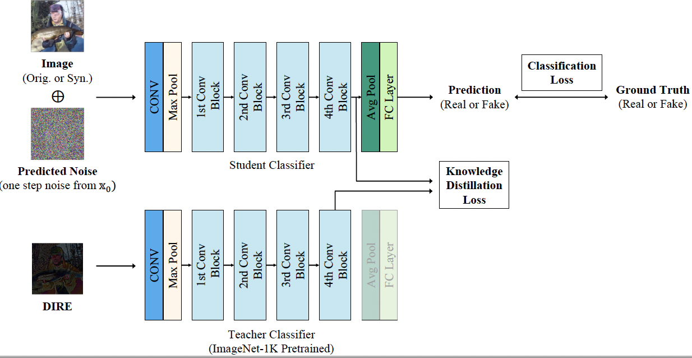

# Distil-DIRE
Distil-DIRE is a lightweight version of DIRE, which can be used for real-time applications. Instead of calculating DIRE image directly, Distl-DIRE aims to reconstruct the features of corresponding DIRE image forwared by a image-net pretrained classifier with one-step noise of DDIM inversion. 



## Data Preparation
Before training the model on your own dataset, you need to prepare the dataset in the following format:
```bash
mydataset/train|val|test
└── images
    ├── fakes
    │   └──img1.png...
    ├── reals
        └──rimg1.png...
```

After preparing the dataset, you can calculate the epsilons and dire images for the dataset using the following script:
```bash
bash compute_dire_eps.sh
```

After running the script, you will have the following directory structure:
```bash
mydataset/train|val|test
└── images
    ├── fakes
    │   └──img1.png...
    ├── reals
        └──rimg1.png...
└── eps
    ├── fakes
    │   └──img1.pt...
    ├── reals
        └──rimg1.pt...
└── dire
    ├── fakes
    │   └──img1.png...
    ├── reals
        └──rimg1.png...
``` 
Note that we currently provide single-gpu preprocessing script. But you can modify the script to run on multiple gpus. For eps and dire calculation we set the DDIM steps to 20. This should be same when inference.

### Train
For training Distil-DIRE, we only provide single gpu training script. 
```
python3 y1_train.py
```
 
You should prepare dataset in the following format:
```
mydataset/train/val/test
└── images
    ├── fakes
    │   └──img1.png...
    ├── reals
    │   └──rimg1.png...
└── eps
    ├── fakes
    │   └──img1.pt...
    ├── reals
    │   └──rimg1.pt...
└── dire
    ├── fakes
        └──img1.png...
    ├── reals
        └──rimg1.png...

```
For eps calculation, you can use the following script:
```
python3 y1_eps.py
```

## Deploy

Pretrained models are available in the following S3 paths.

| Model | S3 Model Path |
| --- | --- |
| ADM | s3://truemedia-dataset/256x256-adm.pt |
| Celeba-HQ DIRE| s3://truemedia-dataset/celebahq_sdv2.pth |
| ImageNet DIRE | s3://truemedia-dataset/imagenet_adm.pth |
| Distil-DIRE | s3://truemedia-dataset/y1distil-truemedia-240408-e19.pth |


### Test locally.
```
python -u -m server
curl -X GET http://localhost:8000/healthcheck
curl -X POST http://localhost:8000/predict \
    -H "Content-Type: application/json" \
    --data '{"file_path":"https://www.evalai.org/ocasio.mp4"}'

```
### with Docker 
```
export DOCKER_REGISTRY="miraflow" # Put your Docker Hub username here  
export DATE=`date +%Y%m%d` # Get the current date
# Build the Docker image for runtime
docker build -t "$DOCKER_REGISTRY/dire-yewon:rt-$DATE" -f Dockerfile-run .

# Build the Docker image for development
docker build -t "$DOCKER_REGISTRY/dire-yewon:dev-$DATE" -f Dockerfile-dev .


# Push your docker image to docker hub
docker login

docker push "$DOCKER_REGISTRY/dire-yewon:rt-$DATE"

docker push "$DOCKER_REGISTRY/dire-yewon:dev-$DATE"
```


Run this Docker image locally on a GPU to test that it can run inferences as expected:
```
docker run --gpus=all -d --rm -p 80:8000 --env SERVER_PORT=8000  --name "yewon-dire" "$DOCKER_REGISTRY/dire-yewon:rt-latest"

# Devl env 
export WORKDIR="~/Projects/yewon/"
docker run --gpus=all --name=yewon_gpu_all_dire -v "$WORKDIR:/workspace/" -ti -e  "$DOCKER_REGISTRY/yewon-dire:dev-latest"

# work inside the container (/workspace)
```

### Note
* This repo runs on ADM diffusion model (256x256, unconditional) trained on ImageNet 1k dataset and ResNet-50 deepfake classifier trained on ImageNet 1k dataset. 
* Minimum requirements: 1 GPU, 10GB VRAM
* Decision of transforms in model inference influences the model performance a lot. For low-latency, it is not recommended to use 5Crops or 10Crops.


map port 80 on your host to port 8000 in the Docker container. AWS only allows 80.

..and in a separate terminal run the following command one or more times

```
curl -X GET http://localhost:8000/healthcheck
```
until you see {"healthy":true}

```
curl -X POST http://localhost:8000/predict \
    -H "Content-Type: application/json" \
    --data '{"file_path":"https://www.evalai.org/ocasio.mp4"}'
```

sudo usermod -a -G docker ubuntu
allowing ubuntu user to execute Docker commands without needing superuser privileges. 

```
curl -X POST http://ec2-54-212-97-80.us-west-2.compute.amazonaws.com/predict \
    -H "Content-Type: application/json" \
    --data '{"file_path":"https://www.evalai.org/ocasio.mp4"}'
```


## Acknowledgments
Our code is developed based on [DIRE](https://github.com/ZhendongWang6/DIRE), [guided-diffusion](https://github.com/openai/guided-diffusion) and [CNNDetection](https://github.com/peterwang512/CNNDetection). Thanks for their sharing codes and models.

## Citation
If you find this work useful for your research, please cite our paper:
```
TODO: arxiv the paper
```
